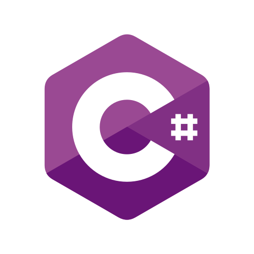
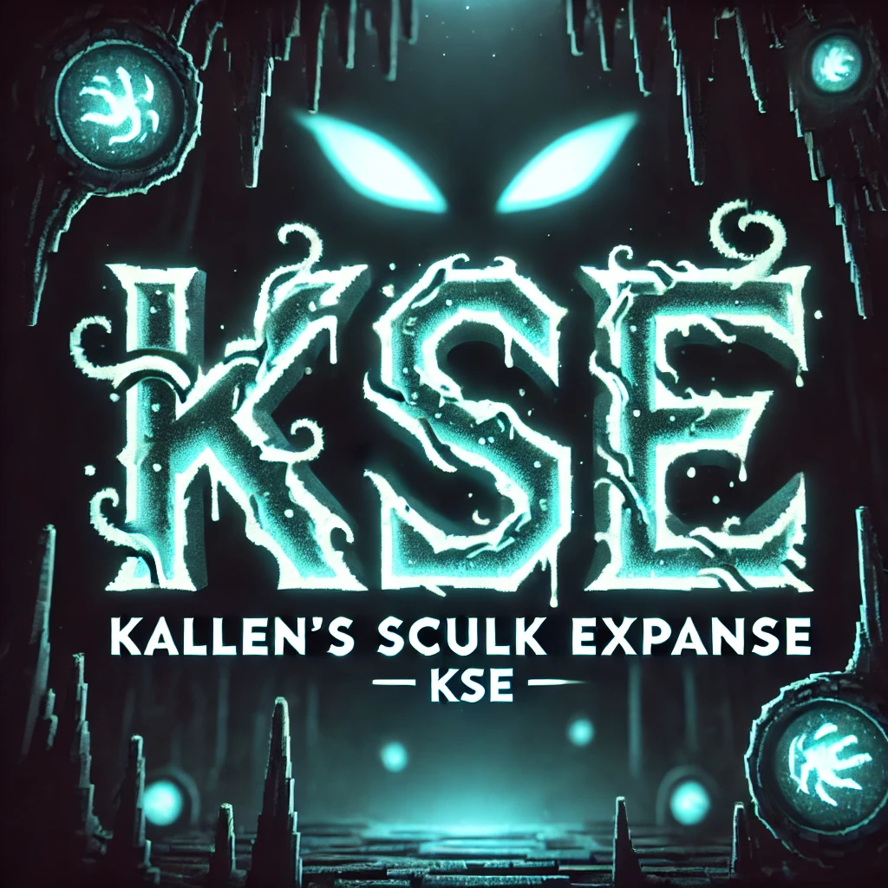
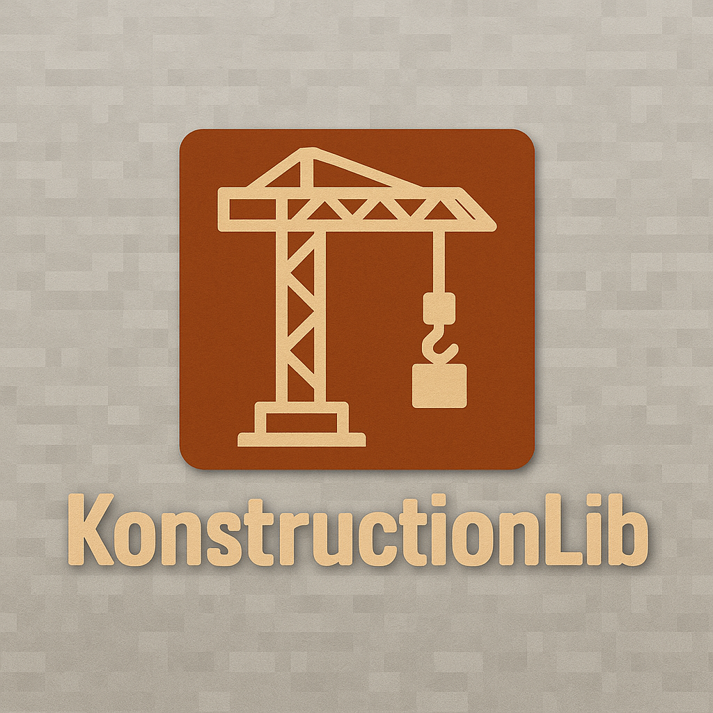
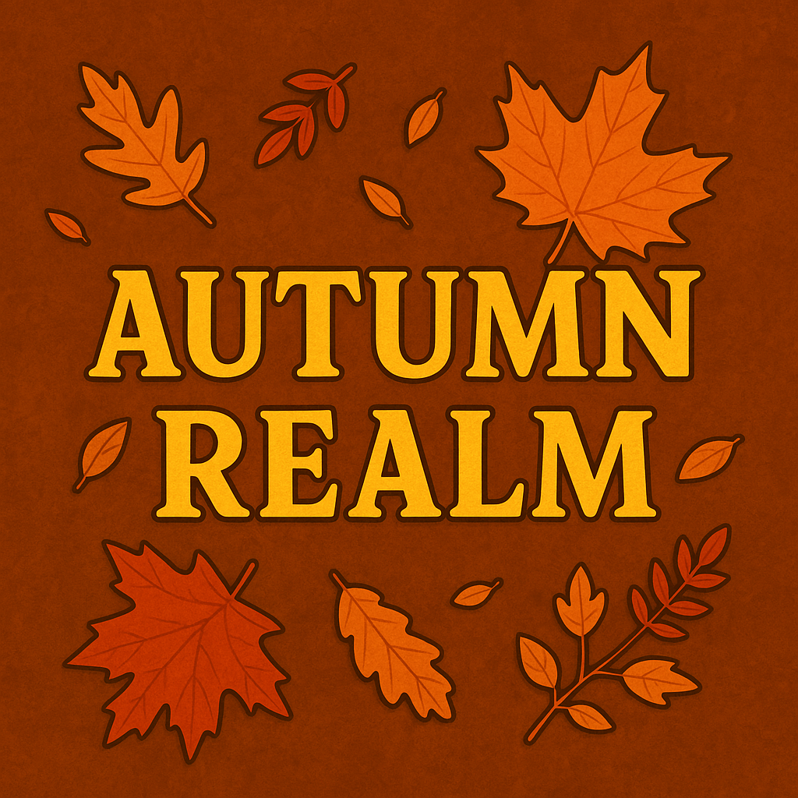

# Hello.  My name is Kayden Ireland.
## I am currently a Senior in college studying Computer Science

- 🌱 I’m currently learning Rust and language development
- 👯 I’m looking to collaborate on Minecraft and Terraria Mods
- 🤔 I’m looking for help with Unity, collabrating on projects
- ⚡ Some projects I want to work on are basic games, solitaire/playing card games, and sports simulators.
- 💬 Topics that interest me include sports, geography, and astronomy
- 📫 How to reach me: See social media links on my profile

 

  

<!--
**kaydenireland/kaydenireland** is a ✨ _special_ ✨ repository because its `README.md` (this file) appears on your GitHub profile.

Here are some ideas to get you started:

- 🔭 I’m currently working on ...
- 🌱 I’m currently learning ...
- 👯 I’m looking to collaborate on ...
- 🤔 I’m looking for help with ...
- 💬 Ask me about ...
- 📫 How to reach me: ...
- 😄 Pronouns: ...
- ⚡ Fun fact: ...
-->

 

## Languages I am familiar with
   

 

## I am currently learning:

## I would like to learn languages such as:
   

  
  

  

## Projects that I have worked on:
  

